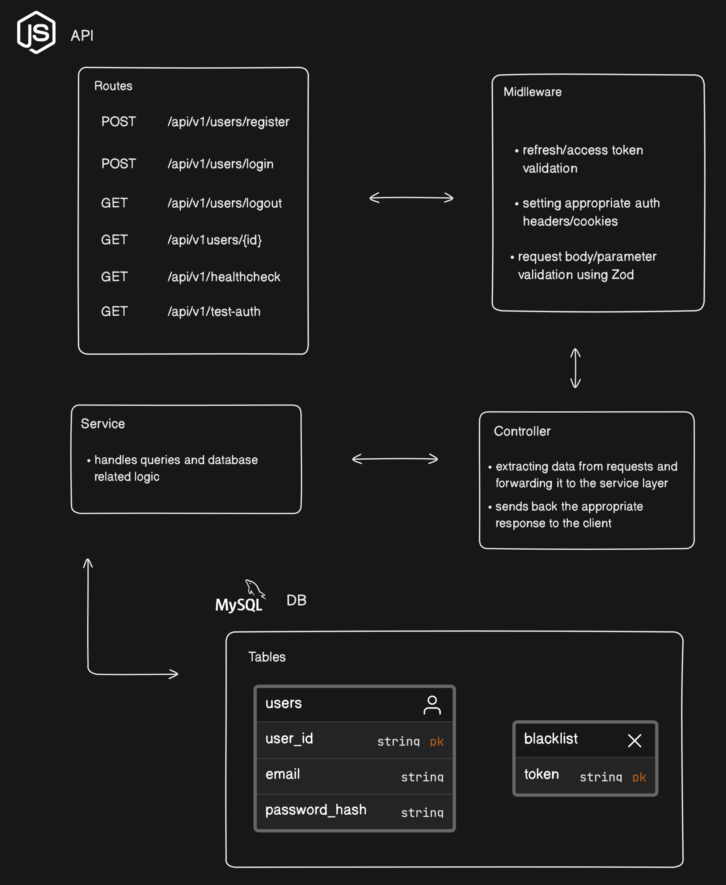

# Express Auth API Setup

The purpose of this repository is to create a starting point for an express API in Node.js with JSON Web Token authentication. 
It aims to follow best practices and create a solid authentication service from the go, so the development process can run more smoothly.
The main design and business logic is based on the following sources: 

* https://github.com/TomDoesTech/REST-API-Tutorial-Updated
* https://dev.to/m_josh/build-a-jwt-login-and-logout-system-using-expressjs-nodejs-hd2

### Technologies used

* Typescript
* Node.js
* Express
* MySQL

### Overview

